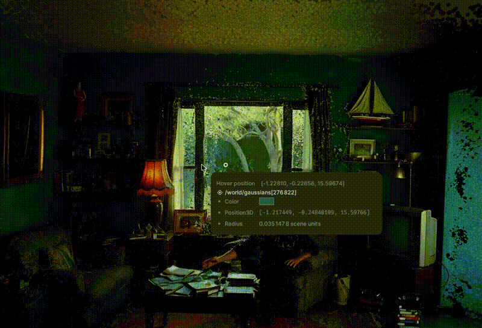

# Splatline

Convert 2D videos and photos into interactive 3D scenes using pluggable Gaussian-splatting backends and Rerun. **Splatline** is a toolkit for exploring Gaussian splat videos in 3D, with depth maps, navigation tools, pose overlays, and creative effects.

> **v2.0.0** is a complete rebuild focused on **2D-to-3D scene reconstruction quality**: three new state-of-the-art reconstruction backends (VGGT, DepthSplat, LongSplat) alongside SHARP and TripoSplat, a tiered human motion pipeline, and a FastAPI + SSE backend. v1 scripts keep working unchanged. See [CHANGELOG.md](CHANGELOG.md) for the full diff. Splatline itself is **MIT-licensed**; see [License](#-license) and [NOTICE.md](NOTICE.md) for third-party restrictions.

## Demo Video



**[Click here to download the full demo video](docs/assets/demo_video.mov)** | [View thumbnail](docs/assets/demo_thumbnail.jpg)

---

## ✨ What's New in v2.0.0

v2 keeps every v1 script working and adds a modern architecture on top. The focus is **reconstruction quality** — upgrading from per-frame independent splats to temporally coherent, geometrically consistent 3D scenes.

### Five implemented reconstruction backends

A backend registry lets you swap the 3D reconstruction model without changing your workflow. On **first run**, Splatline shows a backend selector with license transparency; the choice persists in `~/.splatline/config.json`.

**Per-frame backends** (fast, feed-forward):

- **SHARP** (Apple, non-commercial research) — the v1 default. Per-frame 3DGS from a single image.
- **TripoSplat** (MIT, SIGGRAPH 2026) — fully open, commercial-safe single-image 3DGS.

**Video-native backends** (new in v2, the core upgrade):

- **VGGT** (CVPR 2025 Best Paper) — geometry foundation model. Feed-forward camera poses + dense depth + point cloud from video frames in under 1 second. **Replaces COLMAP entirely** — no slow SfM needed. Processes up to 50 frames per forward pass for global consistency. Pre-trained model auto-downloads from HuggingFace.
- **DepthSplat** (CVPR 2025, MIT) — multi-view depth-conditioned Gaussian splatting. Uses 2+ context views for geometrically consistent 3DGS (not single-image like SHARP). Built-in PLY export, pre-trained models on HuggingFace. Keyframe group selection with overlapping windows for temporal coherence.
- **LongSplat** (ICCV 2025, NVlabs) — **video-native coherent 3DGS**. Produces a single coherent 3DGS scene from the entire video using MASt3R pose estimation and temporal consistency losses. This solves v1's biggest problem: flickering between independent per-frame splats. Training-based (optimizes per video, slower but temporally coherent).

Tracked for future integration: **SplineGS** (CVPR 2025), **NoPoSplat** (ICLR 2025), **AnySplat** (SIGGRAPH Asia 2025), **VolSplat** (ECCV 2026).

Select with `--splat-backend sharp|triposplat|vggt|depthsplat|longsplat`. See [docs/SPLAT_MODELS.md](docs/SPLAT_MODELS.md).

#### What this means for reconstruction quality

| Problem in v1 | Solution in v2 |
|---|---|
| Per-frame independent splats → flickering | LongSplat: single coherent scene with temporal consistency |
| No camera poses (COLMAP needed) | VGGT: feed-forward camera poses in <1s |
| Single-image only (no multi-view) | DepthSplat: 2+ views for geometric consistency |
| No global geometry | VGGT: dense depth + point cloud from whole video |

### Tiered human pipeline

v2 adds a tiered human reconstruction pipeline, selected with `--human-tier skeleton|mesh|both`.

- **Tier 1 — skeleton:** **MotionBERT** (MIT, ICCV 2023) temporal 3D pose lifting. A dual-stream spatio-temporal transformer looks at up to **243 frames at once**, producing smooth, temporally consistent 3D motion, then fuses it with Gaussian splat depth for metric scale.
- **Tier 2 — mesh:** **HMR 2.0 / 4DHumans** (MIT) SMPL body mesh recovery + **PHALP** (MIT) 3D-aware identity tracking. Produces a textured 3D human body in the scene, not just a skeleton.
- 2D pose detection defaults to **YOLO26-pose** (Ultralytics, 2026); **RTMPose** (Apache-2.0) is the AGPL-free alternative.

See [docs/ATHLETE_TWIN.md](docs/ATHLETE_TWIN.md).

### FastAPI + SSE backend

The v1 stdlib HTTP server is replaced by a FastAPI backend at [`ui/server.py`](ui/server.py) with Server-Sent Events for real-time progress streaming on long ML jobs, Pydantic validation, and auto OpenAPI docs at `/docs`.

New endpoints: `/api/config`, `/api/backends`, `/api/tiers`, `/api/jobs/{id}/stream` (SSE). Start it with `python ui/server.py`.

### Infrastructure

- **ONNX Runtime** for inference optimization (INT8 pose quantization, 2-4x speedup).
- **Hugging Face Hub** for versioned model download and caching (no re-downloads).
- **YOLO26-pose** as the default 2D pose detector.

### 3D Video Viewer (`run_video_3d.py`)

A standalone script that runs the full pipeline — extract frames, convert to 3DGS with SHARP, and view in Rerun — with two viewing modes:

```bash
# Point cloud mode (original splats)
python run_video_3d.py

# Solid mesh mode (gap-filled surface with video colors)
python run_video_3d.py solid
```

**Point cloud mode** renders each frame's Gaussian splats as colored 3D points. Colors are converted from SHARP's internal linearRGB to sRGB for correct brightness.

**Solid mesh mode** reconstructs a continuous triangle mesh from each frame's point cloud using voxel-based surface reconstruction (marching cubes at 768-voxel resolution, 2.9M vertices per frame). Colors come from the original SHARP point cloud — no modification, no blending. The result is a solid, gap-free 3D surface with original colors.

### SLAM 3D Mapping (`run_slam_3d.py`)

A monocular visual SLAM script that builds a 3D map of the scene while tracking the camera's trajectory through the video:

```bash
python run_slam_3d.py /path/to/video.mp4
```

**How it works:**
- Extracts ORB features from each video frame (3000 features/frame)
- Matches features between consecutive frames using Lowe's ratio test
- Estimates camera pose via essential matrix decomposition (RANSAC)
- Triangulates matched features into 3D world points
- Accumulates camera trajectory and map points across keyframes
- Visualizes everything in Rerun: camera path (yellow line), camera position (red dot), 3D map points (colored by source video), and matched features on the source frame

**Output:**
- Real-time Rerun visualization with timeline playback
- PLY point cloud file (`<video_name>_slam_map.ply`) saved alongside the video

No CUDA required — pure Python with OpenCV ORB features. Works on macOS (MPS/CPU). Processes ~120 frames in ~4 seconds.

### Image-to-3D Solid Mesh (`run_image_3d.py`)

Convert a single image into a super high-resolution solid 3D mesh:

```bash
# Default (1024 voxel resolution)
python run_image_3d.py /path/to/photo.jpg

# Maximum resolution (1536 voxels — ~10M+ vertices)
python run_image_3d.py /path/to/photo.png --res 1536

# Export only, no viewer
python run_image_3d.py /path/to/photo.jpg --res 1024 --no-view

# Custom output directory
python run_image_3d.py /path/to/photo.jpg --output-dir my_3d_output
```

**Pipeline:**
1. SHARP converts the image to 1.1M 3D Gaussian points
2. Voxel-based surface reconstruction (marching cubes at 1024+ resolution)
3. Bilinear color interpolation from source image + point cloud blend (60/40)
4. Exports PLY and OBJ mesh files with vertex colors
5. Visualizes in Rerun with pinhole camera + source image overlay

**Resolution guide:**
| `--res` | Vertices | Faces | Time | Memory |
|---------|----------|-------|------|--------|
| 512 | ~1.2M | ~2.4M | ~2s | ~1GB |
| 768 | ~2.9M | ~5.8M | ~6s | ~2GB |
| 1024 | ~5.1M | ~10.3M | ~13s | ~4GB |
| 1536 | ~11M+ | ~22M+ | ~40s | ~8GB |

At 1024 resolution, the mesh has 356K unique colors sampled from the source image via bilinear interpolation.

### Splat Viewer (`run_splat_viewer.py`)

View any PLY file as Gaussian splats in Rerun — works with both SHARP 3DGS format and simple point cloud PLYs:

```bash
# View a SHARP Gaussian splat PLY
python run_splat_viewer.py output_grok_3d/gaussians/frame_000000.ply

# View a simple point cloud PLY (red/green/blue properties)
python run_splat_viewer.py output_frame_000000_3d/frame_000000_points.ply
```

**What it does:**
- Loads the PLY file directly via `plyfile` (no SHARP dependency for viewing)
- Supports two PLY formats:
  - **SHARP 3DGS format** (`f_dc_0/1/2`, `opacity`, `scale_0/1/2`) — converts SH coefficients to sRGB colors, applies sigmoid to opacity, filters low-opacity points
  - **Simple point cloud format** (`red/green/blue`) — uses colors directly
- Computes splat radii from scale properties
- Renders in Rerun with scale-based point sizes

No CUDA required — runs on macOS (MPS/CPU). No web browser needed.

---

## 🎯 For Non-Technical Users - Quick Start

**New to coding? No problem!** Follow these steps to turn your videos and photos into 3D scenes.

### What You Need:
1. A computer (Mac, Windows, or Linux)
2. Python installed (download from [python.org](https://www.python.org/downloads/))
3. Your video file (MP4, MOV, AVI) or photo (JPG, PNG)

### Step-by-Step Guide:

#### **Convert a Video to 3D (Recommended)**

1. **Open Terminal (Mac/Linux) or Command Prompt (Windows)**
2. **Navigate to this folder** (where you downloaded this project)
   ```bash
   cd /path/to/splatline
   ```
3. **Install required software** (run these commands):
   ```bash
   pip install rerun-sdk numpy pillow opencv-python scipy torch tqdm
   pip install sharp
   ```
4. **Convert your video to 3D:**
   ```bash
   python scripts/converters/video_to_3d_high_quality.py your_video.mp4 mps
   ```
   *Replace `your_video.mp4` with your actual video filename*

5. **Wait for processing** - This takes a few minutes depending on video length. The ML-SHARP model (~2.5GB) downloads automatically on first use.

6. **View your 3D scene:**
   ```bash
   python scripts/visualizers/video_complete_viewer.py -i output_your_video/gaussians/
   ```

#### **View an Existing 3D File (.ply)**

If you already have a `.ply` file:

1. **Open Terminal/Command Prompt**
2. **Navigate to this folder**
3. **View the 3D file:**
   ```bash
   python scripts/visualizers/visualize_with_rerun.py -i path/to/your/file.ply
   ```

### Controls in the 3D Viewer:

- **Left Click + Drag**: Rotate the view
- **Right Click + Drag**: Pan/move the view
- **Scroll Wheel**: Zoom in/out
- **Double Click**: Reset view

### Tips:
- Start with short videos (10-30 seconds) for faster processing
- Make sure your video has good lighting and clear objects
- The first run downloads the ML-SHARP model (~2.5GB)

### Need Help?
Check the [Troubleshooting](#-troubleshooting) section below.

---

## 🚀 Setup Guide

### Prerequisites

1. **Python 3.8 or higher** - Check with: `python --version` or `python3 --version`
2. **pip** (Python package manager) - Usually comes with Python
3. **Git** (optional, for cloning the repository)

### Installation Steps

#### Step 1: Install Python Dependencies

```bash
pip install -r requirements.txt
```

Or install individually:

```bash
pip install rerun-sdk numpy pillow opencv-python scipy torch tqdm
```

#### Step 2: Install ML-SHARP

**ML-SHARP (Sparse Hierarchical Attention-based Radiance Prediction)** is Apple's model for converting 2D images/videos into 3D Gaussian Splatting scenes. Official repository: [apple/ml-sharp](https://github.com/apple/ml-sharp)

##### Option A: Install via pip (Recommended)

```bash
pip install sharp
```

The ML-SHARP model weights (~2.5GB) will be downloaded automatically when you run the video conversion script. The model is hosted at:
- Model URL: `https://ml-site.cdn-apple.com/models/sharp/sharp_2572gikvuh.pt`

##### Option B: Install from Source (GitHub)

If you want to install from the official GitHub repository:

1. Clone the ML-SHARP repository:
   ```bash
   git clone https://github.com/apple/ml-sharp.git
   cd ml-sharp
   ```

2. Create a conda environment (recommended by ML-SHARP):
   ```bash
   conda create -n sharp python=3.13
   conda activate sharp
   ```

3. Install dependencies:
   ```bash
   pip install -r requirements.txt
   ```

4. Install the package:
   ```bash
   pip install -e .
   ```

**Note:** The ML-SHARP Python package (`sharp`) provides:
- `sharp.models` - Model definitions and predictor creation (`PredictorParams`, `create_predictor`)
- `sharp.utils.gaussians` - Gaussian Splatting utilities (`load_ply`, `save_ply`, `unproject_gaussians`)
- `sharp.utils.io` - Image I/O utilities
- `sharp.utils.color_space` - Color space conversions

**ML-SHARP CLI:** You can also use the official ML-SHARP CLI:
```bash
# Convert images to 3D Gaussian Splats
sharp predict -i /path/to/input/images -o /path/to/output/gaussians

# Test installation
sharp --help
```

#### Step 3: Verify Installation

Test that everything is installed correctly:

```bash
python -c "import rerun; import numpy; import torch; import sharp; print('✓ All dependencies installed!')"
```

You should see: `✓ All dependencies installed!`

#### Step 4: Test with Sample Data

If you have sample `.ply` files in `output_test/`, try visualizing one:

```bash
python scripts/visualizers/visualize_with_rerun.py -i output_test/IMG_4707.ply --size 2.0
```

### System Requirements

- **Operating System**: macOS, Linux, or Windows
- **RAM**: 8GB minimum, 16GB recommended
- **GPU**: Optional but recommended for faster processing
  - **CUDA** (NVIDIA GPUs on Windows/Linux)
  - **MPS** (Apple Silicon Macs - M1, M2, M3, etc.)
  - **CPU**: Works but will be slower
- **Disk Space**: At least 5GB free space for models and outputs

### Device Selection

When converting videos, the script automatically detects the device:
- **CUDA**: NVIDIA GPUs (fastest)
- **MPS**: Apple Silicon GPUs (fast)
- **CPU**: Fallback (slower)

You can also specify manually:
```bash
python scripts/converters/video_to_3d_high_quality.py video.mp4 cuda  # For NVIDIA GPU
python scripts/converters/video_to_3d_high_quality.py video.mp4 mps   # For Apple Silicon
python scripts/converters/video_to_3d_high_quality.py video.mp4 cpu   # For CPU only
```

---

## 📖 Usage Examples

### 1. Convert 2D Video to 3D

**High Quality (Recommended):**
```bash
python scripts/converters/video_to_3d_high_quality.py your_video.mp4 mps
```

This creates an `output_your_video/` directory with:
- `frames/` - Extracted video frames (PNG)
- `gaussians/` - 3D Gaussian Splat files (PLY) - one per frame

**Process Every Nth Frame (Faster):**
```bash
# Process every 2nd frame (2x faster)
python scripts/converters/video_to_3d_high_quality.py video.mp4 mps 2

# Process every 5th frame (5x faster)
python scripts/converters/video_to_3d_high_quality.py video.mp4 mps 5
```

**Video to 3D + human pose (YOLO):**

Converts each frame with ML-SHARP, runs multi-person pose estimation (YOLOv8x-pose), and opens a Rerun layout with three panels: 3D Gaussian scene, 3D skeletons (depth from the splat cloud), and the video with pose overlay.

```bash
pip install ultralytics
python scripts/converters/video_to_3d_with_pose.py your_video.mp4 --size 4.0
```

Use existing frames and PLYs without re-running SHARP:

```bash
python scripts/converters/video_to_3d_with_pose.py \
  --gaussians-dir output_your_video/gaussians \
  --frames-dir output_your_video/frames \
  --size 4.0
```

- `--device` / `--skip` apply when converting from a video (same as `video_to_3d_high_quality.py`).
- `--size` scales joint and bone thickness in 3D.
- YOLO weights download automatically on first run; use the same Python environment for `pip install ultralytics` as for `python3`.

**Standard Quality:**
```bash
python scripts/converters/video_to_3d.py your_video.mp4
```

**Quick Preview:**
```bash
python scripts/converters/video_to_3d_simple.py your_video.mp4
```

### 2. View 3D Video/Scene

**Single PLY File:**
```bash
python scripts/visualizers/visualize_with_rerun.py -i output_test/IMG_4707.ply --size 2.0
```

**Complete 3D Video Viewer:**
Shows original video, depth maps, 3D point cloud, and navigation data side by side:
```bash
python scripts/visualizers/video_complete_viewer.py \
    -i output_your_video/gaussians/ \
    --max-frames 30 \
    --size 2.0
```

**Options:**
- `-i, --input`: Directory containing PLY files (gaussians folder)
- `--max-frames`: Maximum frames to process (default: all)
- `--skip`: Process every Nth frame (default: 1)
- `--resolution`: Occupancy grid resolution in meters (default: 0.5)
- `--obstacle-height`: Obstacle height threshold in meters (default: 0.5)
- `--size`: Point size multiplier (default: 1.0)

**Video Navigation Analysis:**
```bash
python scripts/visualizers/video_navigation.py \
    -i output_your_video/gaussians/ \
    --max-frames 30
```

### 3. Build Navigation Map

Extract navigation data from 3D scenes:
```bash
python scripts/navigation/build_navigation_map.py \
    -i output_test/IMG_4707.ply \
    --resolution 0.5
```

**With Path Planning:**
```bash
python scripts/navigation/build_navigation_map.py \
    -i output_test/IMG_4707.ply \
    --resolution 0.5 \
    --plan-path \
    --start 0 0 \
    --goal 50 50 \
    -o navigation_map.json
```

### 4. Apply Effects

**Depth-based Fog Effect:**
```bash
python scripts/creative/apply_depth_effects.py -i scene.ply --effect fog
```

**Create Camera Path (Orbit):**
```bash
python scripts/creative/create_camera_path.py -i scene.ply --path orbit
```

---

## 📁 Project Structure

```
splatline/
├── scripts/
│   ├── converters/            # 2D video to 3D conversion
│   │   ├── video_to_3d_high_quality.py  ⭐ Recommended
│   │   ├── video_to_3d_with_pose.py     # SHARP + YOLO pose + Rerun
│   │   ├── video_to_3d.py
│   │   └── video_to_3d_simple.py
│   ├── visualizers/           # 3D visualization viewers
│   │   ├── video_complete_viewer.py     ⭐ Complete viewer with dual windows
│   │   ├── video_navigation.py
│   │   ├── visualize_with_rerun.py
│   │   ├── visualize_with_360_background.py
│   │   └── visualize_with_custom_bg.py
│   ├── navigation/            # Navigation & SLAM tools
│   │   ├── build_navigation_map.py
│   │   ├── extract_slam_data.py
│   │   └── demo_navigation.py
│   └── creative/              # Creative effects
│       ├── apply_depth_effects.py
│       ├── compose_3d_scenes.py
│       └── create_camera_path.py
├── utils/                      # Reusable utility modules
│   ├── depth_rendering.py     # Depth map rendering
│   ├── frame_processing.py    # Frame processing
│   ├── navigation.py          # Navigation algorithms
│   ├── pathfinding.py         # Pathfinding
│   ├── visualization.py       # Viewer setup
│   ├── config.py              # Configuration
│   ├── io_utils.py            # File I/O
│   └── geometry.py            # 3D geometry
├── examples/                   # Example scripts
├── tests/                      # Test scripts
├── configs/                    # Configuration files
├── data/                       # Sample data
│
├── run_video_3d.py             # ⭐ Video → 3D (point cloud or solid mesh)
├── run_image_3d.py             # ⭐ Image → high-res solid 3D mesh
├── run_slam_3d.py              # ⭐ Monocular SLAM 3D mapping
├── run_splat_viewer.py         # ⭐ View any PLY as splats in Rerun
└── ui/server.py                # FastAPI + SSE backend
```

---

## 🎮 3D Viewer Controls

**Rotate View:**
- Left click + drag

**Pan/Move View:**
- Right click + drag (primary)
- Middle mouse + drag
- Shift + Left click + drag

**Zoom:**
- Mouse wheel / Trackpad scroll

**Reset View:**
- Double click anywhere

**Tips:**
- Both 3D windows in the complete viewer work independently
- Use the timeline at the bottom to scrub through video frames
- You can pan, zoom, and rotate each window separately

---

## 🛠️ Utility Modules

The `utils/` module provides reusable components:

- **`depth_rendering.py`**: Render depth maps from 3D points
- **`frame_processing.py`**: Load and process PLY files
- **`navigation.py`**: Ground detection, obstacle detection, occupancy grids
- **`pathfinding.py`**: A* pathfinding algorithm
- **`visualization.py`**: Set up Rerun viewers
- **`config.py`**: Configuration classes
- **`io_utils.py`**: File I/O helpers
- **`geometry.py`**: 3D transformations

**Usage Example:**
```python
from utils import (
    load_gaussian_data,
    render_depth_map,
    extract_ground_plane,
    setup_complete_viewer_blueprint
)

# Load PLY file
data = load_gaussian_data("scene.ply")

# Render depth map
depth_map, depth_colored = render_depth_map(
    data['positions'],
    data['colors'],
    resolution=(1280, 720)
)
```

See `examples/` directory for complete examples.

---

## 📊 Output Structure

When converting videos, the output structure is:

```
output_<video_name>/
├── frames/          # Extracted video frames (PNG)
│   ├── frame_000000.png
│   ├── frame_000001.png
│   └── ...
├── gaussians/       # 3D Gaussian Splat files (PLY)
│   ├── frame_000000.ply
│   ├── frame_000001.ply
│   └── ...
└── json/            # Metadata (optional)
    └── ...
```

---

## 🔧 Configuration

Default configurations are in `utils/config.py`:

- **`ViewerConfig`**: Point sizes, opacity thresholds, rotations
- **`NavigationConfig`**: Obstacle heights, grid resolution
- **`DepthConfig`**: Depth rendering settings
- **`ConversionConfig`**: Video conversion settings

You can customize these:
```python
from utils import ViewerConfig, NavigationConfig

viewer_cfg = ViewerConfig(point_size_multiplier=2.0, opacity_threshold=0.2)
nav_cfg = NavigationConfig(obstacle_height=0.7, grid_resolution=0.3)
```

---

## 🆘 Troubleshooting

### Common Issues

#### **Import Errors**

**Problem:** `ModuleNotFoundError: No module named 'rerun'` or similar

**Solution:**
```bash
pip install -r requirements.txt
pip install sharp
```

#### **ML-SHARP Not Found**

**Problem:** `ModuleNotFoundError: No module named 'sharp'`

**Solution:**
```bash
pip install sharp
```

If that doesn't work, install from the official GitHub repository:
```bash
git clone https://github.com/apple/ml-sharp.git
cd ml-sharp
pip install -r requirements.txt
pip install -e .
```

Or use conda (recommended by ML-SHARP):
```bash
git clone https://github.com/apple/ml-sharp.git
cd ml-sharp
conda create -n sharp python=3.13
conda activate sharp
pip install -r requirements.txt
pip install -e .
```

#### **Model Download Issues**

**Problem:** Model download fails or is slow

**Solution:**
- Check your internet connection
- The model is ~2.5GB, ensure you have enough disk space
- Model URL: `https://ml-site.cdn-apple.com/models/sharp/sharp_2572gikvuh.pt`
- You can manually download and place it in a cache directory

#### **GPU Not Detected**

**Problem:** CUDA/MPS errors or GPU not detected

**Solution:**
- **NVIDIA GPU (CUDA):**
  - Install PyTorch with CUDA: `pip install torch torchvision --index-url https://download.pytorch.org/whl/cu118`
  - Check CUDA: `python -c "import torch; print(torch.cuda.is_available())"`
- **Apple Silicon (MPS):**
  - MPS is automatically available on Apple Silicon Macs
  - Use `mps` device: `python scripts/converters/video_to_3d_high_quality.py video.mp4 mps`
- **CPU Fallback:**
  - Use `cpu`: `python scripts/converters/video_to_3d_high_quality.py video.mp4 cpu`
  - Note: CPU is much slower

#### **File Not Found**

**Problem:** `FileNotFoundError` when running scripts

**Solution:**
- Run scripts from the project root directory
- Use absolute paths if relative paths don't work
- Check that input files exist

#### **Memory Errors**

**Problem:** Out of memory during processing

**Solution:**
- Process fewer frames: `--max-frames 10`
- Use lower resolution videos
- Close other applications
- Use CPU instead of GPU if GPU memory is limited

#### **Python Version Issues**

**Problem:** Scripts don't work with your Python version

**Solution:**
- Make sure you have Python 3.8 or higher: `python --version`
- Use `python3` instead of `python` if needed
- Consider using a virtual environment

#### **Rerun Version Mismatch - Blank Viewer**

**Problem:** Rerun viewer is blank/nothing displays, with errors like:
- "Rerun Viewer: v0.23.1 vs Rerun SDK: v0.27.0"
- "dropping LogMsg due to failed decode"
- "transport error"

**Solution:**
This is caused by version mismatch. The viewer cannot decode messages from a newer SDK.

**Option 1: Downgrade SDK to match viewer (Recommended)**
```bash
pip install rerun-sdk==0.23.1
```
This matches your viewer version (v0.23.1) and should fix the blank viewer.

**Option 2: Update viewer to match SDK**
Follow the error message to update the viewer to v0.27.0, or:
```bash
# Using cargo (if you have Rust installed)
cargo binstall --force rerun-cli@0.27.0

# Or download from: https://github.com/rerun-io/rerun/releases/0.27.0/
```

**Note:** The decode errors mean the viewer can't display data - this must be fixed for visualization to work.

---

## 📝 Notes

- The ML-SHARP library (`sharp`) is required for 2D-to-3D video conversion
- The ML-SHARP model weights (~2.5GB) download automatically on first use
- Output directories are created automatically
- PLY files should be in ML-SHARP Gaussian Splatting format
- Rerun viewer runs independently - close the window to exit

---

## 🙏 Credits & Acknowledgments

This project uses these open-source technologies:

### Core Technologies

- **[Rerun](https://github.com/rerun-io/rerun)** - Visualize Everything Fast
  - SDK for logging, storing, querying, and visualizing multimodal data
  - Built in Rust using egui
  - Licensed under Apache-2.0
  - Created by the team at [rerun.io](https://rerun.io)
  - [GitHub](https://github.com/rerun-io/rerun) | [Documentation](https://www.rerun.io/docs)

- **[Apple ML-SHARP](https://github.com/apple/ml-sharp)** - Sharp Monocular View Synthesis in Less Than a Second
  - Apple's model for converting 2D images/videos to 3D Gaussian Splatting scenes
  - Official GitHub repository: [apple/ml-sharp](https://github.com/apple/ml-sharp)
  - Project page: [apple.github.io/ml-sharp](https://apple.github.io/ml-sharp/)
  - Research paper: [arXiv:2512.10685](https://arxiv.org/abs/2512.10685)
  - Model weights provided by Apple
  - Model hosted at: `https://ml-site.cdn-apple.com/models/sharp/sharp_2572gikvuh.pt`
  - Installation: `pip install sharp` or install from source

### Additional Dependencies

- **PyTorch** - Deep learning framework
- **NumPy** - Numerical computing
- **OpenCV** - Computer vision library
- **Pillow** - Image processing
- **SciPy** - Scientific computing
- **tqdm** - Progress bars

### Special Thanks

- **Rerun Team** ([@rerun-io](https://github.com/rerun-io)) for creating the visualization tool
- **Apple Research** for developing ML-SHARP and making it available
- All open-source contributors

---

## 🔗 Related Links

### ML-SHARP Resources
- **ML-SHARP GitHub**: https://github.com/apple/ml-sharp
- **ML-SHARP Project Page**: https://apple.github.io/ml-sharp/
- **Research Paper**: https://arxiv.org/abs/2512.10685
- **ML-SHARP Model**: `https://ml-site.cdn-apple.com/models/sharp/sharp_2572gikvuh.pt`
- **Installation**: `pip install sharp` or install from GitHub
- **ML-SHARP CLI**: `sharp predict -i <input> -o <output>` (see [official docs](https://github.com/apple/ml-sharp))

### Rerun Resources
- **Rerun GitHub**: https://github.com/rerun-io/rerun
- **Rerun Documentation**: https://www.rerun.io/docs
- **Rerun Website**: https://rerun.io
- **Rerun Discord**: Join for community support

### Documentation
- **Quick Start Guide**: See [QUICKSTART.md](QUICKSTART.md)
- **Project Structure**: See [STRUCTURE.md](STRUCTURE.md) (if available)
- **Examples**: See [examples/README.md](examples/README.md)

---

## 📄 License

**Splatline** is licensed under the **MIT License** — see [LICENSE](LICENSE). It builds on Apple's ML-SHARP model and Rerun; it is an independent community toolkit, not an Apple product.

Some optional backends and models have different licenses. The most important restrictions:

- **Apple SHARP** — non-commercial research only. For commercial use, select **TripoSplat** (MIT), **VGGT** (MIT code), or **DepthSplat** (MIT) via `--splat-backend triposplat|vggt|depthsplat`.
- **LongSplat** (NVlabs) — check NVlabs terms before commercial use.
- **VGGT model checkpoint** — CC-BY-NC (code is MIT, checkpoint is non-commercial).
- **Ultralytics YOLO26-pose** — AGPL-3.0. For networked service deployments, open-source your service code or purchase an Ultralytics commercial license. Local desktop use does not trigger AGPL.
- **SMPL body model** (needed by HMR 2.0) — registration required at [smplify.is.tue.mpg.de](https://smplify.is.tue.mpg.de).

See [NOTICE.md](NOTICE.md) for the full third-party license breakdown.

**Third-party licenses:**
- **Rerun**: Apache-2.0 License
- **PyTorch**: BSD-style License
- **Other dependencies**: See [NOTICE.md](NOTICE.md)

---

**Splatline v2.0.0** — made with [Rerun](https://github.com/rerun-io/rerun), five reconstruction backends (SHARP, TripoSplat, VGGT, DepthSplat, LongSplat), and a tiered human pipeline (MotionBERT, HMR 2.0). MIT-licensed.
